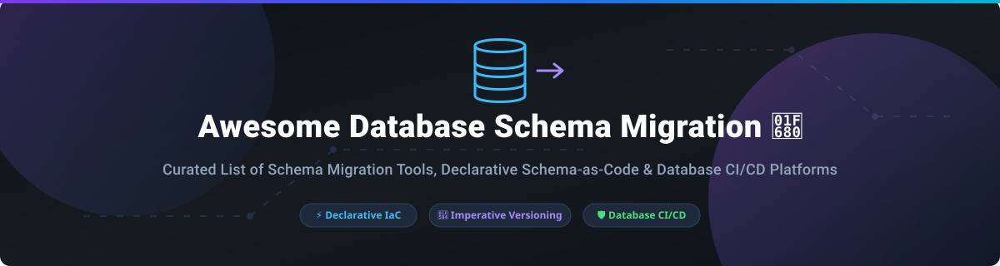

# Awesome Database Schema Migration 🚀

  
  
  
  
  

## 📌 Top Database Schema Migration Platforms & Ecosystem

**A Curated List of Database Schema Migration Tools, Declarative Schema-as-Code Frameworks, Version Control & Database CI/CD Platforms** 🛠️

*Last updated: October 2026* 📅

Welcome to the definitive guide on **Database Schema Migration** platforms and open-source tools. Managing database schema changes—whether imperative SQL migrations or declarative Schema-as-Code—is vital for modern DevOps, Agile development, and Continuous Delivery (CI/CD) pipelines. This repository covers leading SaaS platforms and top-rated open-source GitHub repositories designed to keep your database schemas in sync across development, staging, and production environments. 💡

---

## 📑 Table of Contents

- [📊 Sector Overview & Market Dynamics](#-sector-overview--market-dynamics)
- [☁️ SaaS / Hosted Platforms](#%EF%B8%8F-saas--hosted-platforms)
- [💻 Open-Source GitHub Projects](#-open-source-github-projects)
- [🤝 How to Contribute](#-how-to-contribute)
- [📜 Disclaimer](#-disclaimer)
- [❤️ Support & Community](#%EF%B8%8F-support--community)
- [📈 Star History](#-star-history)

---

## 📊 Sector Overview & Market Dynamics

> 💡 **Market Size & Structure**: The global Database Security, DevOps, and Schema Migration software market is estimated at **$1.8B – $2.5B annually** (2026). The market is **moderately fragmented**: mature legacy database deployment is dominated by consolidated developer tooling vendors like Redgate, while rapid modernization in cloud-native and declarative Infrastructure-as-Code (IaC) has enabled agile entrants (like Ariga Atlas and Bytebase) to capture modern developer mindshare.

---

## ☁️ SaaS / Hosted Platforms

Below is a comparison of leading SaaS and enterprise platforms for Database Schema Migration and Database CI/CD, sorted in descending order by estimated company size (ARR / Valuation / Funding):

| Platform 🏢 | Company Size (ARR / Valuation / Funding) 📈 | Pricing (Starting Tier) 💰 | Free Tier / Trial Limits 🎁 | Key Features & Overview 🔍 |
| :--- | :--- | :--- | :--- | :--- |
| **[Flyway Enterprise](https://www.red-gate.com/products/flyway/enterprise/)** 🚀 | **$100M+ ARR** *(Acquired by Redgate Software / Bregal Sagemount)* | Custom quote-based pricing (Subscription-first enterprise licensing) | **14-day free trial** of Enterprise features; Free Community edition available for basic SQL migrations | Commercial edition of Flyway. Adds **Undo script generation** for rollbacks, **drift detection**, object-level versioning, and custom code analysis for SQL Server, PostgreSQL, Oracle, and MySQL. |
| **[Liquibase Secure](https://www.liquibase.com/)** 🛡️ | **$27.8M Funding** *(Estimated $50M–$100M Valuation)* | **$499/month** (Starter tier for up to 5 apps & 2 DB types) | **30-day free trial** for Liquibase Secure; Free Community edition available | Commercial edition of Liquibase (formerly Datical DB). Adds **policy checks**, dangerous pattern blocking, structured rollbacks, and compliance mapping (SOX, PCI DSS, DORA). |
| **[Atlas Cloud](https://atlasgo.io/)** ⚡ | **$50M–$100M Valuation** *(Estimated; $1M+ ARR)* | **$9/user/month** (Pro plan) + $39/month per extra DB target | **Free tier forever** for 1 project & 2 target databases (includes 100 free CI runs/month) | De facto standard for **declarative Schema-as-Code**. Brings Terraform-like workflows, 50+ safety linting rules, schema diffing, and cloud-native CI/CD integrations. |
| **[Bytebase Cloud](https://bytebase.com/)** 🔒 | **$3M Funding** *(Seed round backed by Matrix Partners)* | **$20/user/month** (Pro plan) | **Free Community plan** for up to 20 users and 10 database instances forever | Web-based database CI/CD workspace (CNCF Landscape). Features 200+ SQL lint rules, DBA approval workflows, staged auto-deployments, and audit logging. |

---

## 💻 Open-Source GitHub Projects

The open-source ecosystem provides battle-tested, developer-first migration tools across multiple paradigms (Declarative, Imperative, ORM-Integrated, and Script-Based).

The projects below are sorted by **GitHub Star Count (descending)** 🌟:

| Repository 📦 | GitHub Stars ⭐ | Paradigm / Type ⚙️ | Description & Key Features 📝 |
| :--- | :--- | :--- | :--- |
| **[Prisma Migrate](https://github.com/prisma/prisma)** 🔷 |  | ORM-Integrated | **Hybrid declarative/imperative TypeScript tool.** Generates editable versioned `.sql` migrations directly from declarative Prisma schema definitions. Ideal for Node.js / TypeScript applications. |
| **[Drizzle Kit](https://github.com/drizzle-team/drizzle-orm)** 🌧️ |  | ORM-Integrated | **TypeScript-first declarative migration CLI for Drizzle ORM.** Automatic SQL migration file generation, schema push, and zero-overhead TypeScript schema definitions. |
| **[golang-migrate](https://github.com/golang-migrate/migrate)** 🐹 |  | Imperative CLI | **The most popular Go database migration tool.** Runs simple `.sql` up/down migration scripts. Supports 20+ databases and CLI/Go library usage. |
| **[sqlc](https://github.com/kyleconroy/sqlc)** ⚡ |  | Code Generation & Schema | **Generates type-safe Go/Python/TypeScript code from raw SQL schemas and queries.** Works seamlessly alongside schema migration CLI tools. |
| **[Bytebase](https://github.com/bytebase/bytebase)** 🛡️ |  | Database DevOps Platform | **CNCF Landscape Database CI/CD platform.** Web UI for DBAs and developers with SQL linting, GitOps review pipelines, and access control. |
| **[Goose](https://github.com/pressly/goose)** 🦢 |  | Imperative CLI / Go | **Lightweight Go migration tool.** Supports plain SQL files or custom Go migration functions. Database agnostic and fast. |
| **[Flyway Community](https://github.com/flyway/flyway)** 🪽 |  | Imperative SQL-First | **The developer-friendly SQL-first migration standard.** Applies versioned SQL files (`V1__init.sql`) in order; supports 50+ relational databases. |
| **[Atlas](https://github.com/ariga/atlas)** 🗺️ |  | Declarative Schema-as-Code | **Modern schema engine powered by HCL/SQL.** Inspects, diffs, and applies schema changes using declarative code or versioned SQL migrations with 50+ safety linter checks. |
| **[dbmate](https://github.com/amacneil/dbmate)** 🧉 |  | Imperative CLI | **Framework-agnostic database migration tool.** Uses plain SQL scripts, single standalone Go binary, and simple environment variable configuration. |
| **[Liquibase Community](https://github.com/liquibase/liquibase)** 💧 |  | Imperative / Abstraction | **Database-agnostic changelog migration tool.** Uses SQL, XML, YAML, or JSON changelogs with explicit rollback capabilities across 60+ SQL databases. |
| **[Alembic](https://github.com/sqlalchemy/alembic)** 🐍 |  | ORM-Integrated | **Python database migration tool for SQLAlchemy.** Autogenerate migration scripts from model differences, supports branch merges and rollbacks. |
| **[Sqitch](https://github.com/sqitchers/sqitch)** 🎯 |  | Dependency-Graph CLI | **VCS-centric change management tool.** Explicit change dependencies (no sequential version numbers), integrated test verification script support. |
| **[Skeema](https://github.com/skeema/skeema)** 🐬 |  | Declarative MySQL | **Declarative schema management for MySQL and MariaDB.** Pure SQL files representing table definitions; auto-generates safe `ALTER TABLE` statements. |
| **[SchemaHero](https://github.com/schemahero/schemahero)** 🦸 |  | Kubernetes Operator | **Kubernetes-native declarative database schema tool.** Converts Kubernetes CRDs into database DDL changes via GitOps workflows. |
| **[standalone-migrations](https://github.com/thuss/standalone-migrations)** 💎 |  | Ruby / Active Record | **Standalone ActiveRecord migrations for non-Rails projects.** Allows using Ruby's schema migration system in any Ruby codebase. |
| **[grate](https://github.com/erikbra/grate)** 🏗️ |  | Script-Based CLI | **Automated database deployment using plain SQL scripts.** Supports SQL Server, Oracle, PostgreSQL, MySQL, and SQLite. |

---

## 🤝 How to Contribute

Contributions are welcome and appreciated! 💖 To add or update an entry:

1. Fork the repository 🍴
2. Create your feature branch (`git checkout -b feature/add-new-tool`) 🌿
3. Add your entry following the established table structure 📋
4. Ensure factual links and accurate descriptions 💡
5. Submit a Pull Request with a short explanation 🚀

Please check [Awesome-Awesome-Awesome](https://github.com/ishandutta2007/Awesome-Awesome-Awesome) for contribution guidelines across awesome lists.

---

## 📜 Disclaimer

- This list is **community-curated** for informational purposes—inclusion does not constitute an endorsement.
- Database schema migration platforms execute DDL/DML statements directly against database engines. Always test migration scripts in non-production environments and implement robust backup policies. 🔒

---

## ❤️ Support & Community

If you find this curated list helpful, please consider supporting the project:

- 🌟 **Star this repository** to help others discover it!
- 🔀 **Fork & Share** with your colleagues, DevOps team, and DBAs.
- 💬 **Join our Discord Community**: 
- ☕ **Sponsor / Buy me a coffee**: If you'd like to support ongoing updates, consider sponsoring on [GitHub Sponsors](https://github.com/sponsors/ishandutta2007).

---

## 📈 Star History

